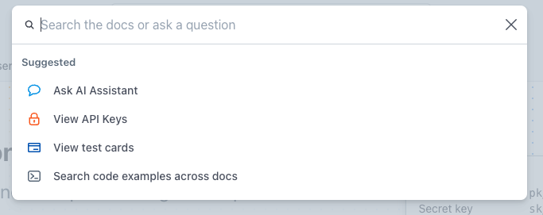
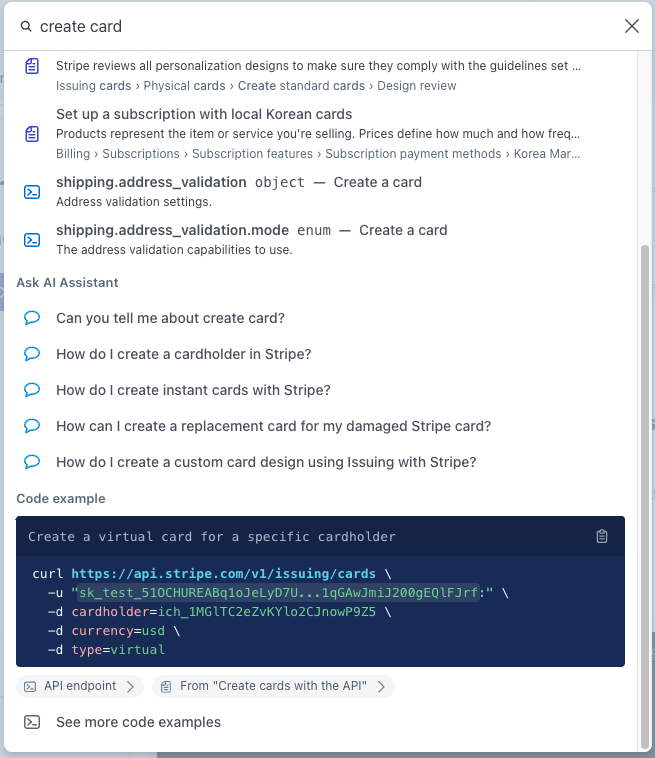
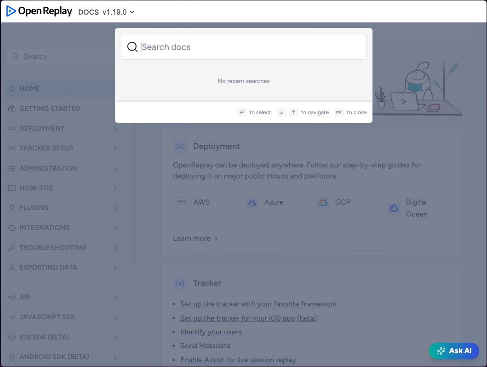
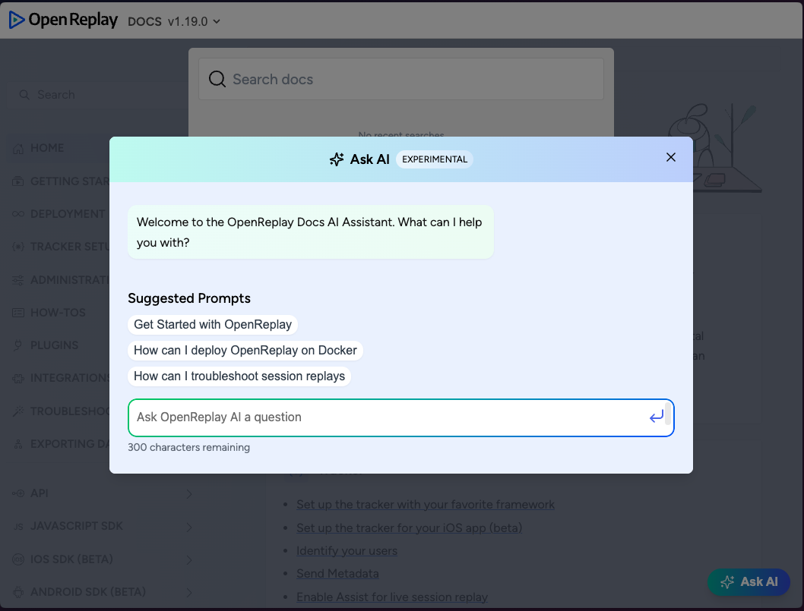
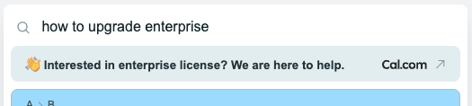
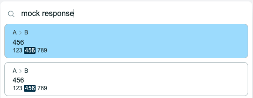
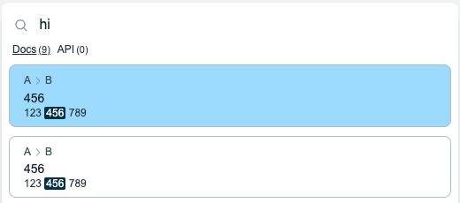

Recently, I have been working on [Canary](https://github.com/fastrepl/canary), an open-source project that aims to provide **Search & Ask** utility to documentation sites. This blog post will serve as an overview of the project until we have a proper landing page.

---

If you want to quickly skim our components visually:

[](https://storybook.getcanary.dev)

If you want to try it in code editor:

[](https://stackblitz.com/edit/canary?file=index.html)

---

> This post starts with a background section for readers who are not familiar with this space.
> If you are not interested, [jump to next section](#whats-special-about-canary).

# Background

Every product that has documentation comes with a search bar. From [non-commercial open-source project](https://starlight.astro.build/) to [$70B company](https://docs.stripe.com).

But if we look at it, most of them look similar, haven't changed much, and fall into three categories:

## Local

Non-commercial projects usually use local search comes with documentation framework or its plugins. It focuses on out-of-the-box search experience, rather than rich features.

Also, since it has to build and send search index to the browser, it is not ideal for large documentation.

> Canary supports both local and cloud search via [provider](https://docs.getcanary.dev/intro/concepts#provider) abstraction.

## Algolia DocSearch

Most of the companies use it. Also, almost every well-known open source project uses it too since it is [free for open-source projects](https://docsearch.algolia.com/apply).

It does the job, but it doesn't have **Ask AI**, nor any way to customize its behavior.

## Custom

Large companies often have something custom. For example, **Stripe**, known for having some of the best documentation since its early days, has a customized search UI to meet its needs.

<p>

<em>Screenshot from Stripe's documentation (1)</em>
</p>

<p>

<em>Screenshot from Stripe's documentation (2)</em>
</p>

And since **Ask AI** is so powerful for large documentation, even startups try to roll out their own.

For example, [OpenReplay](https://openreplay.com), which provides self-hostable session-reply, use Algolia for their documentation. But apparently they built custom **Ask AI** since Algolia is not able to be customized for their needs.

<p>

<em>Screenshot from OpenReplay's documentation, Algolia "Search"</em>
</p>

<p>

<em>Screenshot from OpenReplay's documentation, Custom "Ask"</em>
</p>

---

My gut feeling is that more and more companies will invest resources in a good search bar. It's not only about **Ask AI**.
Users are becoming used to describing their needs and receiving immediate results. Search bar will become an important interface for companies to capture and respond to user requests.

And 🐤 Canary is here to help.

# What's special about Canary?

There's a lot to say, but I'll distill it down to three points:

- [Tiny components that works anywhere](#tiny-components-that-works-anywhere)
- [Modular and open-source](#modular-and-open-source)
- [More than UI components](#more-than-a-ui-components)

## Tiny components that works anywhere

Canary use [Web components](https://developer.mozilla.org/en-US/docs/Web/Web_Components), so browsers know how to render it. No need to bundle entire React or something. It just works anywhere.

All components come with almost zero dependencies, and you can only load subset of them that you need.
For example, you can have only **Search**, only **Ask**, or both. You can add [callouts](#example-1-popup-based-on-user-intent), or just remove them.

And even if you load them ALL, it's still **5-10X smaller** than other solutions.

|             | **Canary**                                                            | Other 1                                                            | Other 2                                                             | Other 3                                                 |
| ----------- | --------------------------------------------------------------------- | ------------------------------------------------------------------ | ------------------------------------------------------------------- | ------------------------------------------------------- |
| Bundle Size | [**0.16 MB**](https://bundlephobia.com/package/@getcanary/web@latest) | [1.9 MB](https://bundlephobia.com/package/@inkeep/uikit-js@latest) | [0.75 MB](https://bundlephobia.com/package/@mendable/search@latest) | [0.87 MB](https://widget.kapa.ai/kapa-widget.bundle.js) |

## Modular and open-source

With Canary, you can compose components to build your own search bar. Each component can be prebuilt one from Canary, or you can bring your own.

It looks like this:

```html
<canary-styles-default theme="light">
  <canary-provider-mock>
    <canary-modal>
      <canary-trigger-searchbar slot="trigger"></canary-trigger-searchbar>

      <canary-content slot="content">
        <canary-search slot="search">
          <canary-search-input slot="input"></canary-search-input>
          <canary-search-results slot="results"></canary-search-results>
        </canary-search>

        <canary-ask slot="ask">
          <canary-ask-input slot="input"></canary-ask-input>
          <canary-ask-results slot="results"></canary-ask-results>
        </canary-ask>
      </canary-content>
    </canary-modal>
  </canary-provider-mock>
</canary-styles-default>
```

- `canary-styles-*`: Helper to style the components
- `canary-provider-*`: Swappable provider for running operations.
- `canary-search-*`: Optional, works with local provider.
- `canary-ask-*`: Optional, to add "Ask AI". Need cloud provider.

Detailed docs can be found [here](https://docs.getcanary.dev/intro/concepts), but we will cover some of them below.

### Example 1: Callout based on user intent

Since search bar is where you capture user's intent, there's many ways to optimize for specific use-case.
`Callout` is one example of this.

Let's say your product is open-core, and you're particularly interested in users who want to use **enterprise** features that require paid license.

Here's how you would optimize for it:

```diff
 <canary-search>
    <canary-search-input slot="input"></canary-search-input>
    <canary-search-results slot="results"></canary-search-results>
+    <canary-callout-cal
+        slot="callout"
+        url=https://cal.com/yujonglee/canary
+        message="<MESSAGE>"
+        keywords="enterprise,api,license,book,schedule,support"
+    ></canary-callout-cal>
 </canary-search>
```

<p>

<em>Cal.com link popup when user shows interest in enterprise features</em>
</p>

We currently only support keyword based detection in `search`. But upcoming release in `canary-provider-cloud` will support semantic detection for `ask` which can act on much richer user intent.

### Example 2: Adapt to your documentation structure

For developer-facing documentation, it's common for it to grow to hundreds of pages, and already structured in some way. If so, you might want the search bar to adapt to it.

For example, If you have a generated, large API reference alongside your hand-written guides, you might want to separate them.

For this, you can just replace component assigned to `results` slot.

```diff
 <canary-search>
    <canary-search-input slot="input"></canary-search-input>
-    <canary-search-results slot="results"></canary-search-results>
+    <canary-search-results-group
+        slot="results"
+        groups="Docs:*;API:\/api\/.+$"
+    ></canary-search-results-group>
 </canary-search>
```

<p>

<em>Using "canary-search-results"</em>
</p>

<p>

<em>Using "canary-search-results-group"</em>
</p>

### Example 3: Zero friction with built-in wrappers

#### Mock provider for development

If you open up the [Stackblitz](https://stackblitz.com/edit/canary?file=index.html) editor, you can see it uses `canary-provider-mock` to simulate the search index.

```html
<canary-provider-mock>
  <!-- Rest of the code -->
</canary-provider-mock>
```

This helps you try look-and-feel of Canary's UI without setting up anything.

#### Local search providers to get started

`canary-provider-pagefind` lets you use local search index generated by [Pagefind](https://github.com/pagefind/pagefind). Framework like [Starlight](https://starlight.astro.build/) support it out of the box, so you can start using it right away.

```html
<canary-provider-pagefind baseUrl="https://docs.example.com">
  <!-- Rest of the code -->
</canary-provider-pagefind>
```

#### Style adaptors for your existing documentation

If you want to use Canary, chances are you already have a documentation website, built with [Docusaurus](https://docusaurus.io/), [Starlight](https://starlight.astro.build/), or something else.

Since each documentation comes with its own style, and you've already configured your own theme, you often want the search bar to simply match your existing style.

For this, Canary provides sets of style wrappers that read [CSS variables](https://developer.mozilla.org/en-US/docs/Web/CSS/Using_CSS_custom_properties) from your theme, transform them, and apply to the Canary components.

```html
<canary-styles-starlight>
  <!-- Rest of the code -->
</canary-styles-starlight>
```

You can find the styling guides [here](https://docs.getcanary.dev/integrations/styling).

---

Examples shown above are all prebuilt components. But again, these are [open-source](https://github.com/fastrepl/canary) [web-components](https://developer.mozilla.org/en-US/docs/Web/Web_Components). It is trivial to build yours and swap them out. (or even contribute to the project!)

## More than UI components

```diff
# your-search-bar.html

- <canary-provider-pagefind>
+ <canary-provider-cloud
+    endpoint="https://cloud.getcanary.dev"
+    key="pk_1234567890">
    <!-- Rest of the code -->
- </canary-provider-pagefind>
+ </canary-provider-cloud>
```

If you are working on a small project, using local providers like `canary-provider-pagefind` might be enough. But if you are working on a commercial project at some scale, you're likely face some limitations.

`canary-provider-cloud` interacts with our [backend](https://github.com/fastrepl/canary/tree/main/core), and exposes additional features like:

- 1\. **Hosted search index** that don't have to send search index to the user.
- 2\. **Ask AI** for your documentation website, Discord, etc.
- 3\. Add **more sources** to the index, like support tickets, forums, etc.
- 4\. **Documentation analytics.** Answer questions like _"What are the most searched terms / asked topic?"_ _"Which pages are outdated?"_.
- 5\. Continous **evaluation and improvements** on search & ask pipelines.

**1, 2** are done, and other improvements including **3, 4, 5** will come in the upcoming releases.

# Before you go

- [Star us on GitHub](https://github.com/fastrepl/canary) to support,
- Join our [Discord](https://discord.gg/canarydev) to ask questions,
- [Schedule a call](https://cal.com/yujonglee/canary) if you like to chat.
